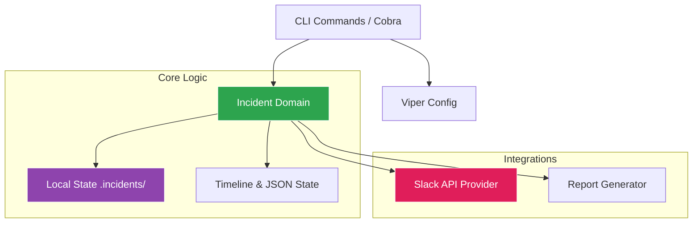

# Go Incident CLI

> A modern and modular CLI tool written in Go for incident management directly from the terminal.

<!-- Real badges (not decorative) -->

[](https://goreportcard.com/report/github.com/ESousa97/goincidentcli)
[](https://pkg.go.dev/github.com/ESousa97/goincidentcli)


[](https://www.codefactor.io/repository/github/esousa97/goincidentcli)

---

goincidentcli is an isolated, local-first incident response tool. It empowers engineers to instantly declare incidents, spin up dedicated local investigation workspaces, automatically provision communication channels via Slack, and seamlessly compile chronologically ordered Markdown post-mortem reports.

<div align="center">
  
</div>

## Demonstration

Declaring an Incident via CLI:
```bash
$ incident declare --title "Authentication API latency spike"
2026/04/05 15:30:00 [INFO] Incident declared: INC-20260405-b7x2
2026/04/05 15:30:01 [INFO] Slack channel created: #inc-20260405-authentication-api-latency-spike
```

Exporting an Incident Report:
```bash
$ incident export --id INC-20260405-b7x2
2026/04/05 16:00:00 [INFO] Report generated at .incidents/INC-20260405-b7x2/report.md
```


## Tech Stack

| Technology | Role |
|---|---|
| **Go** | Main language, ensuring performance and native concurrency. |
| **Cobra** | CLI interface creation and command structuring. |
| **Viper** | Configuration and environment variable management. |
| **Slack API** | Integration for automatic creation of communication channels. |

## Prerequisites

- Go >= 1.21
- A valid Slack Bot Token (optional, if you want Slack integration)

## Installation and Usage

### As binary

```bash
go install github.com/ESousa97/goincidentcli/cmd/incident@latest
```

### From source

```bash
git clone https://github.com/ESousa97/goincidentcli.git
cd goincidentcli
cp .env.example .env
# Edit .env with your settings
make build
make run
```

## Makefile Targets

| Target | Description |
|---|---|
| `build` | Compiles the CLI binary for the current platform. |
| `run` | Runs the compiled CLI. |
| `test` | Runs all application tests. |
| `lint` | Executes code validations. |

## Architecture

The project follows a modular, scalable architecture, decoupling core logic from external integrations.

<div align="center">



</div>

- `cmd/`: CLI entrypoints registered using Cobra.
- `internal/incident/`: Contains the isolated logic for dealing with incidents on disk, creating folders, generating IDs, and reading JSON timelines.
- `internal/slack/`: Slack API integration to request and create custom channels for incident response teams.
- `internal/config/`: Loading global user configuration stored in `~/.incident.yaml` via Viper.

## Commands Reference

| Command | Description | Example |
|---|---|---|
| `declare` | Declares a new incident, creates a local workspace, and spins up a Slack channel. | `incident declare --title "DB Down"` |
| `export` | Generates a Markdown post-mortem report based on the local timeline JSON data. | `incident export --id INC-XXXXXX` |

## API Reference

See the full documentation at [pkg.go.dev](https://pkg.go.dev/github.com/ESousa97/goincidentcli).

## Configuration

Configurations are managed via a `yaml` file located in the user's home path (`~/.incident.yaml`). The CLI auto-creates a template if none exists.

| Key | Description | Requirement |
|---|---|---|
| `api_token` | Optional API token for external systems | Optional |
| `base_url` | Base URL used for integrations | Optional |
| `slack_auth_token` | Slack Bot Token to automatically create channels | Optional |

## Roadmap

- [x] Phase 1: CLI Foundation & Scaffolding - Initialized Cobra CLI with `declare` and `config` commands. Integrated Viper for credential management and local `.incidents/` state isolation.
- [x] Phase 2: Slack Integration - Automated "War Room" creation. Provisions private Slack channels, sets purpose, and posts initial response templates.
- [x] Phase 3: Timeline & Metrics - Implemented a chronological event logger (`incident log`). Integrates with Prometheus API to capture real-time system metrics during incident declaration.
- [x] Phase 4: Automated Post-mortem Generator - Developed a reporting engine using Go templates. Exports incident timelines into structured Markdown files ready for review.
- [x] Phase 5: Interactive TUI Dashboard - Built a "War Room" terminal interface using `bubbletea` and `lipgloss`. Displays real-time incident timers, recent events, and service health status.

## Contributing

Link to [CONTRIBUTING.md](CONTRIBUTING.md) with a summary of how to contribute.

## License

MIT License. See [LICENSE](LICENSE) for more information.

## Author

**Enoque Sousa**

[Portfolio](https://enoquesousa.vercel.app) | [GitHub](https://github.com/ESousa97)
