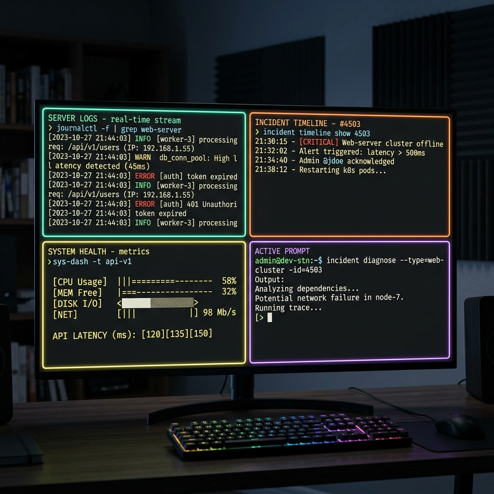
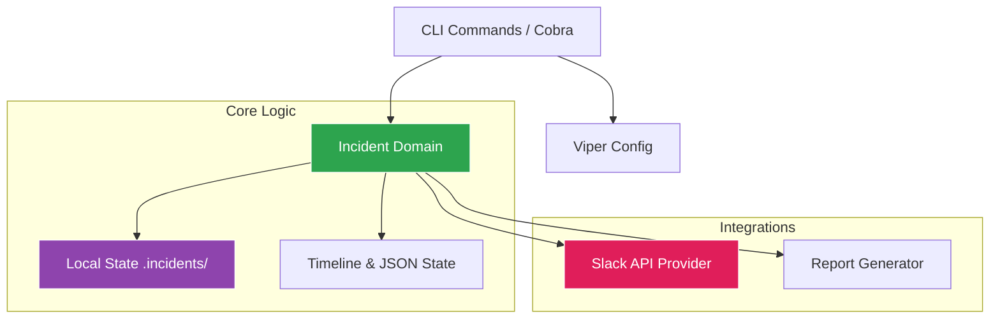

<div align="center">
  <h1>Go Incident CLI</h1>
  <p>A modern and modular CLI tool written in Go for incident management directly from the terminal.</p>

  

  <br>


[](https://goreportcard.com/report/github.com/ESousa97/goincidentcli)
[](https://www.codefactor.io/repository/github/esousa97/goincidentcli)
[](https://pkg.go.dev/github.com/ESousa97/goincidentcli)


</div>

---

`goincidentcli` is an isolated, local-first incident response tool. It empowers engineers to instantly declare incidents, spin up dedicated local investigation workspaces, automatically provision communication channels via Slack, and seamlessly compile chronologically ordered Markdown post-mortem reports.

## About

**Go Incident CLI** is a terminal-based toolkit designed to streamline the entire incident lifecycle. By automating the creation of investigation workspaces, Slack communication channels, and post-mortem reports, it allows engineering teams to focus on technical resolution rather than administrative overhead.

## Demonstration

Declaring an Incident via CLI:

```bash
$ incident declare --title "Authentication API latency spike"
2026/04/05 15:30:00 [INFO] Incident declared: INC-20260405-b7x2
2026/04/05 15:30:01 [INFO] Slack channel created: #inc-20260405-authentication-api-latency-spike
```

Exporting an Incident Report:

```bash
$ incident export --id INC-20260405-b7x2
2026/04/05 16:00:00 [INFO] Report generated at .incidents/INC-20260405-b7x2/report.md
```



## Technologies & Frameworks

<div align="center">
  
  
  
  
  
  
</div>

## Prerequisites

- Go >= 1.21
- A valid Slack Bot Token (optional, for Slack integration)

## Installation and Usage

### As a binary

```bash
go install github.com/ESousa97/goincidentcli/cmd/incident@latest
```

### From source

```bash
git clone https://github.com/ESousa97/goincidentcli.git
cd goincidentcli
cp .env.example .env
# Edit .env with your settings
make build
make run
```

## Makefile Targets

| Target  | Description                                      |
| ------- | ------------------------------------------------ |
| `build` | Compiles the CLI binary for the current platform |
| `run`   | Runs the compiled CLI                            |
| `test`  | Runs all suite of tests                          |
| `lint`  | Executes code validations and spell checks       |
| `deps`  | Downloads and tidies dependencies                |
| `clean` | Removes build artifacts                          |

## Architecture

The project follows a modular, scalable architecture, decoupling core logic from external integrations.

<div align="center">



</div>

- `cmd/`: CLI entrypoints registered using Cobra.
- `internal/incident/`: Contains the isolated logic for dealing with incidents on disk, creating folders, generating IDs, and reading JSON timelines.
- `internal/slack/`: Slack API integration to request and create custom channels for incident response teams.
- `internal/config/`: Loading global user configuration stored in `~/.incident.yaml` via Viper.

## API Reference

See the full documentation at [pkg.go.dev](https://pkg.go.dev/github.com/ESousa97/goincidentcli).

## Configuration

Configurations are managed via a `yaml` file located in the user's home path (`~/.incident.yaml`). The CLI auto-creates a template if none exists.

| Key                | Description                                      | Requirement |
| ------------------ | ------------------------------------------------ | ----------- |
| `api_token`        | Optional API token for external systems          | Optional    |
| `base_url`         | Base URL used for integrations                   | Optional    |
| `slack_auth_token` | Slack Bot Token to automatically create channels | Optional    |
| `prometheus_url`   | URL for Prometheus API queries                   | Optional    |

## Roadmap (Implemented Phases)

- [x] **Phase 1: CLI Foundation & Scaffolding (Scaffolding and Config)**
  - **Objective:** Create the CLI structure and manage credentials securely.
  - **What was done:** Configured Cobra CLI with `declare` and `config` commands. Used Viper to manage Slack tokens and monitoring URLs. Created `.incidents/` folder structure for state isolation.

- [x] **Phase 2: Slack Integration (The Communicator)**
  - **Objective:** Automate the creation of the digital "War Room".
  - **What was done:** Integrated Slack API to create private channels (`inc-{date}-{title}`), set purpose, and post initial response templates with automated ID tracking.

- [x] **Phase 3: Timeline & Metrics (The Chronicler)**
  - **Objective:** Record real-time events and system context.
  - **What was done:** Implemented an event logging system (`incident log`) using JSON. Integrated Prometheus to capture critical metrics at declaration time and attach them to the timeline.

- [x] **Phase 4: Automated Post-mortem Generator (The Reporter)**
  - **Objective:** Eliminate manual post-mortem report writing.
  - **What was done:** Developed a reporting engine using Go `text/template` to generate `post-mortem.md` from incident timelines, including summary, impact, and corrective actions sections.

- [x] **Phase 5: Interactive TUI Dashboard (The Terminal Dashboard)**
  - **Objective:** Create a "War Room" visual experience in the terminal.
  - **What was done:** Built a live dashboard using `bubbletea` and `lipgloss` showing incident timers (MTTR), recent logs, and real-time service health status monitoring.

## Contributing

Check our [CONTRIBUTING.md](CONTRIBUTING.md) to learn how to set up your environment, run tests, and submit Pull Requests.

## License

Distributed under the MIT License. See [LICENSE](LICENSE) for more information.

<div align="center">

## Author

**Enoque Sousa**

[](https://www.linkedin.com/in/enoque-sousa-bb89aa168/)
[](https://github.com/ESousa97)
[](https://enoquesousa.vercel.app)

**[⬆ Back to Top](#go-incident-cli)**

Made with ❤️ by [Enoque Sousa](https://github.com/ESousa97)

**Project Status:** Completed — Ready for production use

</div>
